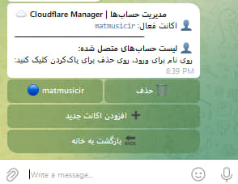
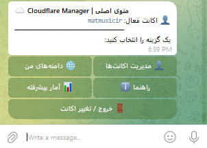
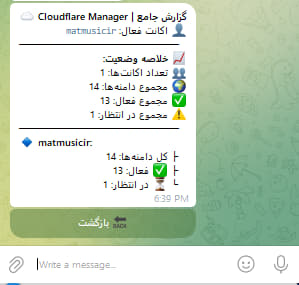
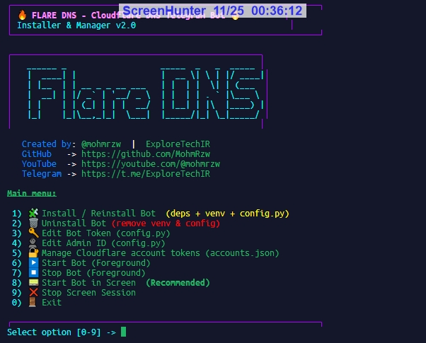

# 🔥 **Flare DNS – ربات تلگرامی مدیریت Cloudflare**

مدیریت کامل DNS و دامنه‌های Cloudflare بدون نیاز به ورود به پنل – فقط داخل تلگرام!

---

## 📹 ویدیو آموزشی 
<a href="https://youtu.be/ag_2o6nJNB0" target="_blank">
  
</a>
> برای مشاهده ویدیو روی تصویر اصلی کلیک کنید.

---
<table align="center">
<tr>
<td align="center">
  <br>
  استارت اولیه
</td>
<td align="center">
  <br>
  منوی ربات
</td>
<td align="center">
  <br>
  آمار ربات
</td>
</tr>
<tr>
<td align="center">
  <br>
  لیست دامنه‌ها
</td>
<td align="center">
  <br>
  لیست رکوردها
</td>
<td align="center">
  <br>
  ویرایش رکورد
</td>
</tr>
</table>


## 🚀 نصب سریع (Quick Install)

```
bash <(curl -sSL https://raw.githubusercontent.com/MohmRzw/cloudflare-flaredns-bot/main/remote-install.sh)
```

### ⚡️ نصب جایگزین (Alternative Install)

اگر روش بالا اجرا نشد:

```bash
git clone https://github.com/MohmRzw/cloudflare-flaredns-bot.git
cd cloudflare-flaredns-bot
chmod +x install.sh
sudo ./install.sh
```

**اسکریپت نصب** به‌صورت خودکار:
✔️ نصب پیش‌نیازها: Python، venv، pip، screen
✔️ ساخت محیط مجازی پایتون (venv)
✔️ ساخت تعاملی فایل `config.py` شامل: BOT_TOKEN, ADMIN_ID, API_URL, ACCOUNTS_FILE
✔️ نمایش منوی گرافیکی ترمینال برای اجرای ربات:
<div align="center" style="border:3px solid #4CAF50; padding:15px; border-radius:15px; display:inline-block; background-color:#f9f9f9;">
  
  <div style="margin-top:10px; font-weight:bold; font-size:18px; color:#4CAF50;">
    منوی اسکریپت نصب ربات و مدیریت
  </div>
</div>

* اجرای عادی
* اجرای داخل screen (پیشنهادی – همیشه روشن)

---


## ✨ ویژگی‌ها (Features)

### 🌐 مدیریت چند اکانت Cloudflare

* ذخیره و مدیریت چند Cloudflare API Token در `accounts.json`
* سوئیچ بین اکانت‌ها از طریق منوی 👤 *مدیریت اکانت‌ها* در ربات

### 🧾 مدیریت دامنه‌ها (Zones)

* نمایش لیست کامل دامنه‌ها
* صفحه‌بندی برای سهولت
* نمایش وضعیت دامنه: Active 🟢 / Pending 🟡

### 🧱 مدیریت رکوردهای DNS

* مشاهده رکوردها: A, AAAA, CNAME, TXT, MX, NS
* افزودن رکورد با ویزارد مرحله‌ای داخل تلگرام
* ویرایش تک‌فیلدی (Name / Content / TTL / Proxy)
* حذف رکورد با تأیید دوبل

### 📊 آمار کلی (Global Stats)

* تعداد کل دامنه‌ها
* تعداد دامنه‌های فعال
* تعداد دامنه‌های Pending

---

## 🔐 امنیت

* فقط کاربری که `ADMIN_ID` در `config.py` با آیدی عددی او یکسان باشد، می‌تواند از ربات استفاده کند
* سایر کاربران پاسخی دریافت نمی‌کنند

---

## 🛠 پیش‌نیازها

* Linux (ترجیحاً Ubuntu 22/24)
* Python 3.8+ (ترجیحاً 3.10+)
* git
* screen *(در صورت نبود، اینستالر خودش نصب می‌کند)*

---

## ⚙️ فایل تنظیمات `config.py`

```python
BOT_TOKEN = "123456789:ABCDEF..."
ADMIN_ID = 2059978172
API_URL = "https://api.cloudflare.com/client/v4"
ACCOUNTS_FILE = "accounts.json"
ICONS = { ... }
```

تمام مقادیر را می‌توان بدون ویرایش دستی فایل، از طریق اینستالر تغییر داد.

---

## 🔐 مدیریت Cloudflare Tokens (`accounts.json`)

نمونه ساختار:

```json
{
  "main": "CF_API_TOKEN_1",
  "client1": "CF_API_TOKEN_2"
}
```

مدیریت از طریق اینستالر:
1️⃣ مشاهده توکن‌ها
2️⃣ افزودن/ویرایش توکن
3️⃣ حذف توکن

---

## ▶️ اجرای ربات

### 1️⃣ اجرای معمولی (Foreground)

از طریق اینستالر:

```
6) Start Bot (Foreground)
```

توقف: `Ctrl + C`

### 2️⃣ اجرای دائمی با screen (پیشنهادی)

```
8) Start Bot in Screen
```

اتصال:

```bash
screen -r flaredns-bot
```

خروج بدون توقف: `Ctrl + A` سپس `D`
توقف screen از اینستالر:

```
9) Stop Screen Session
```

---

## لایسنس

**MIT License © 2025 mohmrzw**
می‌توانید از این پروژه استفاده، کپی، تغییر و توزیع کنید، فقط ذکر نام سازنده الزامی است.

## 📡 ارتباط با من :

* توسعه‌دهنده: **@mohmrzw**
* YouTube: [https://youtube.com/@mohmrzw](https://youtube.com/@mohmrzw)
* تلگرام (ExploreTechIR): [https://t.me/ExploreTechIR](https://t.me/ExploreTechIR)


⭐️ اگر پروژه برات مفید بود، استار یادت نره و باگ‌ها/پیشنهادها تو Issues ثبت کن.
